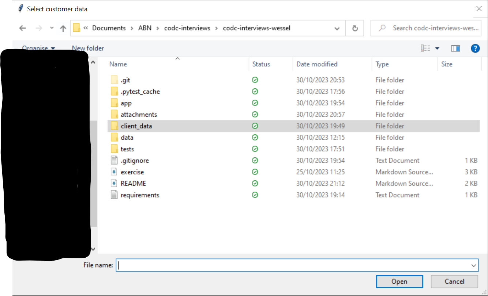
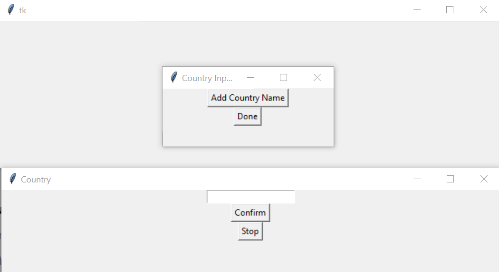
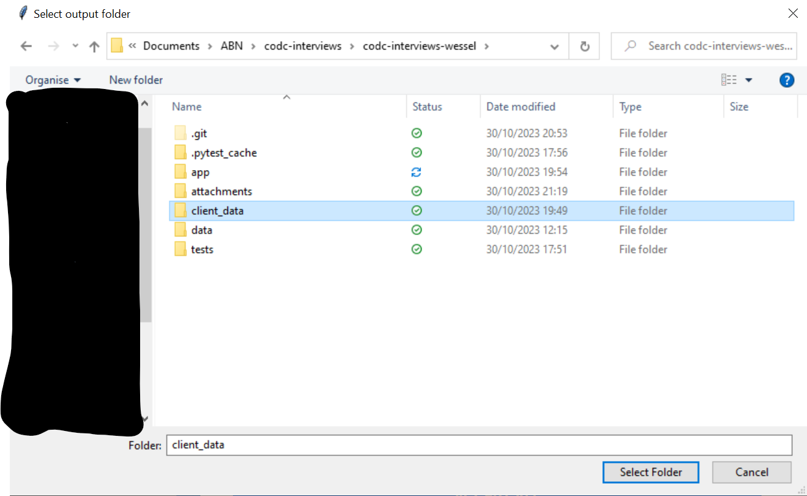

# codc-interviews-wessel

## Application

The codc-interviews-wessel application is a coding application to showcase a basic skillset in software development with the use of Python and PySpark. The application performs a small ETL process to read in customer- and financial data, transform the data into a cleaned and readable format and ultimately write the output into a designated folder. The application requests the user to specify which file locations represent the source data, what countries the user wants to extract and where the .csv output data should be stored. Ultimately, a small unit test can be ran to check functionalities of the written logic.

## How to use the application

### Prerequisites
This application runs with Python 3.8. It is written under the assumption that a user has this version of Python prepared in a ready-to-use environment.

There are a few packages to be installed, which can be done by opening a terminal in the main folder _'codc-interviews-wessel'_. Run the following command in the terminal:

```
pip install -r requirements.txt
```

### app.py

The main application can be run by opening a terminal in the main folder _'codc-interviews-wessel'_ and running the command:

```
python ./app/app.py
```

The user will be requested to select the customer data and afterwards the same window will open and the user will be requested to select the financial data, as shown in the screenshot below.



After selecting the right data files, a new window will be opened in which the user can add countries to filter the data on as shown in the following screenshot:



The user is supposed to add country names until the user has specified all the countries to filter the data on. Then, by selecting the done button, the application will filter the input data on the countries that the user has provided.

Lastly, a new window is opened where the user needs to specify the desired folder location where the output data will be stored.



After selecting the folder, the user should have a .csv file stored named _client_data_abn__<today's date>_.csv_

### test_functions.py
The unit test application can be run by opening a terminal in the main folder _'codc-interviews-wessel'_ and running the command:

```
pytest ./tests/app/utils/test_functions.py
```

The functionality of functions _filter_countries_ and _rename_column_ are tested.
